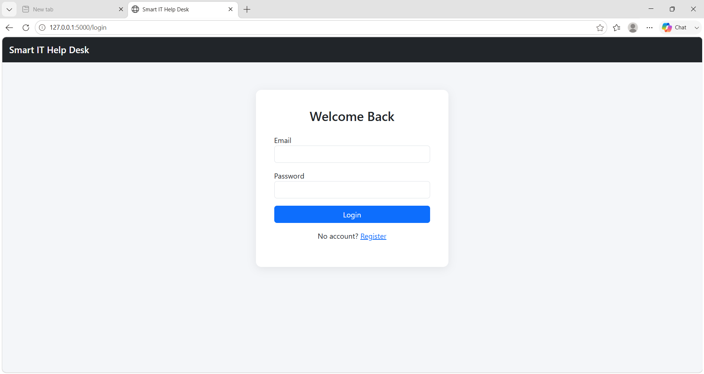
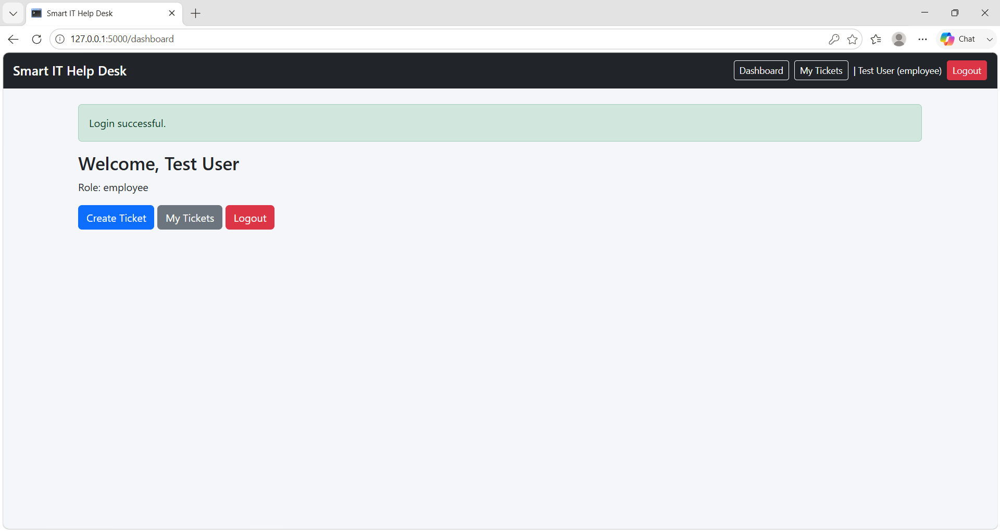
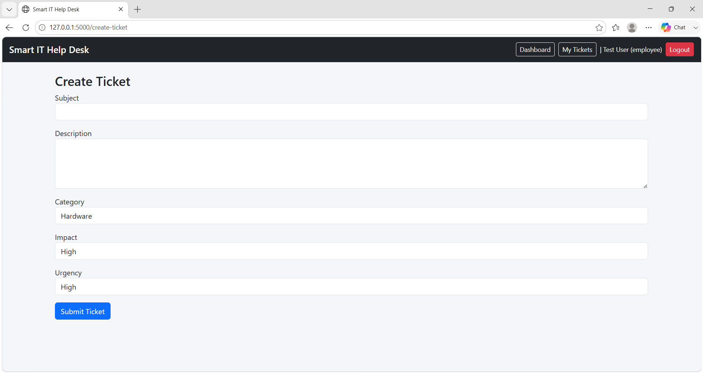
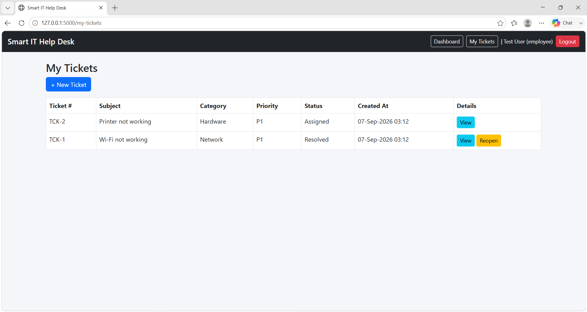
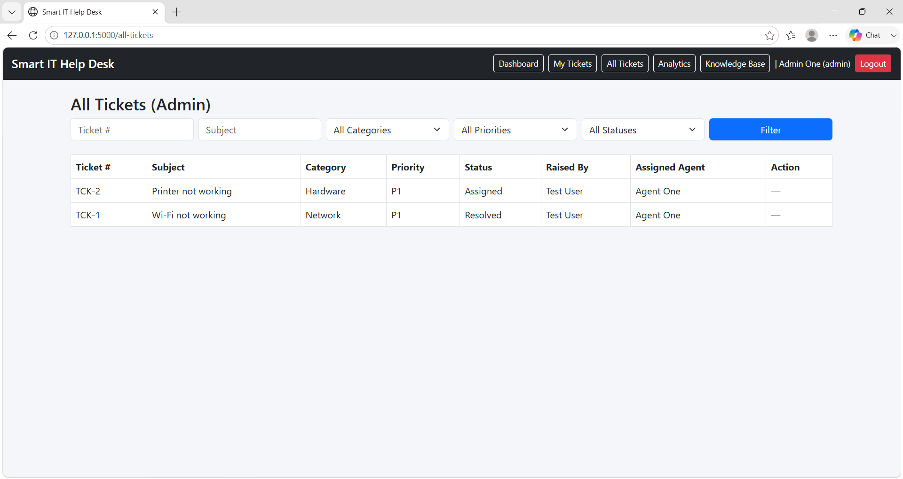
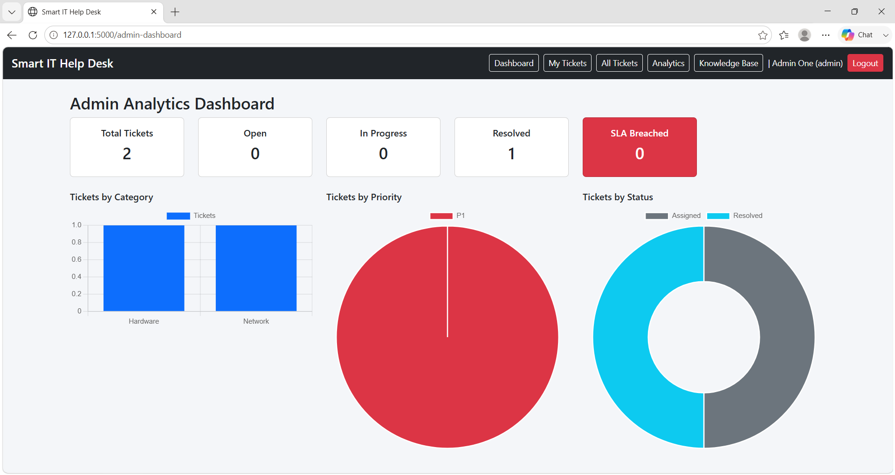
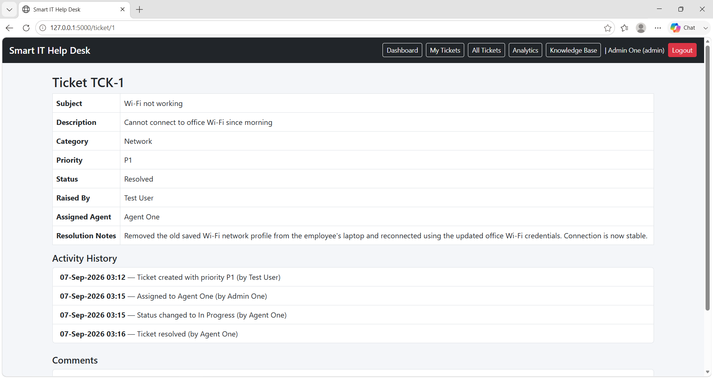
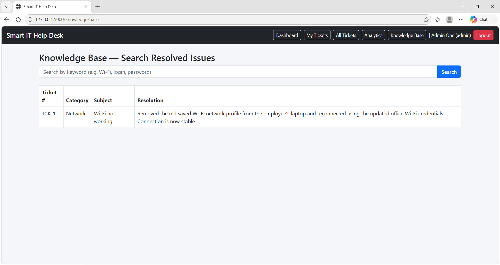

# Smart IT Help Desk & Incident Management System

A simple IT ticketing web app I built to practice full-stack development — employees can raise tickets for tech issues, and support agents/admins can assign, track, and resolve them.

## Why I built this

Most beginner projects either do a basic CRUD app or jump straight into something too fancy to explain in an interview. I wanted something in between — a project close to what a real support/helpdesk tool looks like, built with tech I actually understand (Python, Flask, SQL), without pulling in AI, microservices, or anything I'd struggle to explain if asked.

## What it does

- Employees can register, log in, and raise a ticket describing their issue (Wi-Fi down, laptop issue, login problem, etc.)
- Based on the Impact and Urgency the employee selects, the system automatically calculates a priority (P1–P4) using a simple lookup table — not AI, just plain if-else style logic
- Every ticket gets an SLA deadline depending on its priority (e.g. a P1 has to be resolved within 2 hours)
- Admins assign tickets to support agents
- Agents move tickets through a proper lifecycle: Open → Assigned → In Progress → Resolved → Closed (and an employee can reopen a resolved ticket if the issue isn't actually fixed)
- Every ticket has a comment thread and a full activity log (who did what, and when)
- Agents/admins can search past resolved tickets by keyword — a basic knowledge base, using plain SQL search
- Admins get a dashboard with ticket counts and a few charts (by category, priority, status)

## Roles

- **Employee** — raises tickets, tracks them, comments, reopens if needed
- **Support Agent** — works on tickets assigned to them, resolves with notes
- **Admin** — assigns tickets, sees everything, views analytics

## Priority logic

| Impact | Urgency | Priority |
|---|---|---|
| High | High | P1 |
| High | Medium | P2 |
| Medium | High | P2 |
| High | Low | P3 |
| Medium | Medium | P3 |
| Low | High | P3 |
| Medium | Low | P4 |
| Low | Medium | P4 |
| Low | Low | P4 |

## SLA targets

| Priority | Resolve within |
|---|---|
| P1 | 2 hours |
| P2 | 4 hours |
| P3 | 8 hours |
| P4 | 24 hours |

## Tech used

Python, Flask, Flask-SQLAlchemy, SQLite, Jinja2, HTML/CSS, Bootstrap 5, Chart.js, pytest, Git/GitHub.

## Database

Four tables: `users`, `tickets`, `comments`, `ticket_history`. The tickets table has two separate foreign keys into users — one for who raised the ticket, one for the agent it's assigned to.

## Testing

I tested this in two ways:

1. **Manual testing** — 24 test cases covering registration, login, ticket creation, the priority/SLA logic, role-based access, assignment, status changes, comments, and search. Full list is in `docs/manual_test_cases.md`.
2. **A real bug I found** — while testing, I found that an agent could resolve a ticket directly from "Assigned" without ever moving it to "In Progress" — just by visiting the URL directly. I logged it in `docs/bug_reports.md` and fixed it by adding a status check before allowing resolution.
3. **Automated tests** — 14 pytest tests for the priority engine, SLA calculation, and login/registration, using an in-memory test database so it never touches real data. Run with:
```bash
   pytest tests/ -v
```

## Running it locally

```bash
git clone https://github.com/Nagi16102004/smart-it-helpdesk.git
cd smart-it-helpdesk
python -m venv venv
venv\Scripts\activate
pip install -r requirements.txt
python app.py
```

Then open `http://127.0.0.1:5000`.

## Screenshots

**Login**


**Employee dashboard**


**Creating a ticket**


**My Tickets (with reopen option)**


**Admin — all tickets, with search/filter and assignment**


**Admin analytics dashboard**


**Ticket details — history and comments**


**Knowledge base search**


## What I learned

Building this taught me a lot more about session-based auth and role checks than just reading about them would have. The most useful part, honestly, was the manual testing — I wouldn't have caught the "Assigned → Resolved" bug just by writing code and assuming it worked. It also made me think about database design differently, since I needed two different foreign keys pointing to the same `users` table for the "who raised it" vs "who's working on it" relationship.